# im_practical_programming
This is a landing page for a collection of scripts and projects, some practical and useful day to day, others with no redeeming usefulness other than fun! See below projects and links:

## Big Projects

### digital_compass
This is a project where I designed, manufactured, and coded a digital compass that uses an inertial measurement unit (IMU) to estimate orientation in 3d-space. I implemented an extended kalman filter to (EKF) to do the estimation. Find the repo [here](https://github.com/MZandtheRaspberryPi/digital_compass). A video explanation is available [here](https://www.youtube.com/shorts/Pg_2u4VAHLg) and a video demo is available [here](https://www.youtube.com/shorts/pv6mBfAY-nU).  
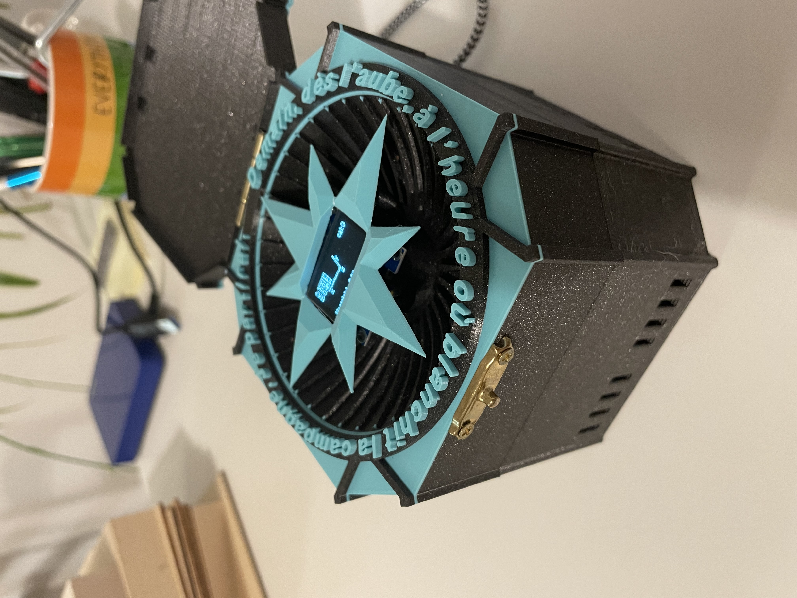  
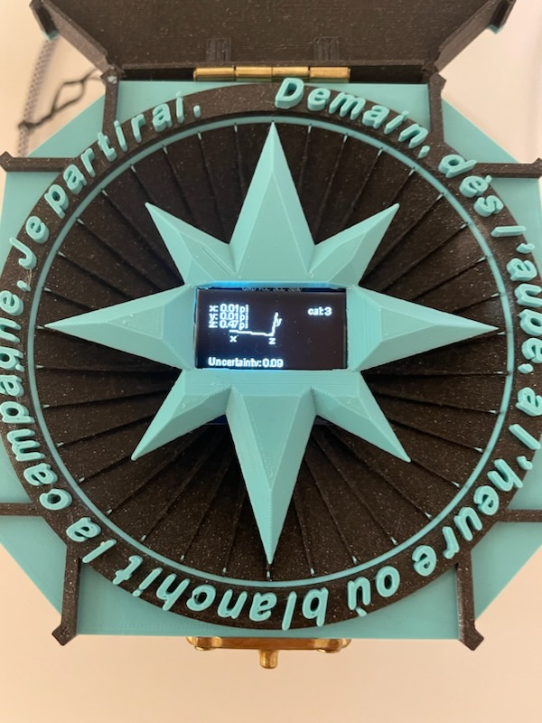  
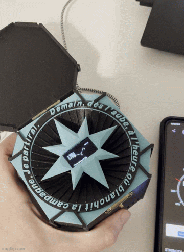  

### robodanceproject.com
This is a project where I implemented a front end in Angular and a back end in C++ to explore and visualize forward kinematics for a quadruped robot.  I deployed this using Amazon Web Service's Lightsail. Find the repo [here](https://github.com/MZandtheRaspberryPi/doggy_dance_project) and the webapp you can interact with [here](http://robodanceproject.com/).
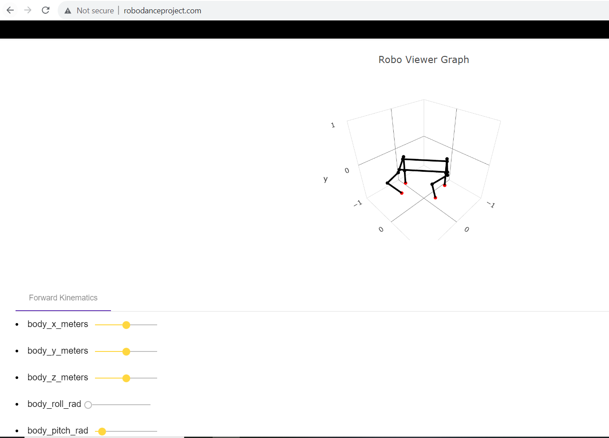  

### toulouse_rover
This was a fun project I did to build an autonomous car, using a lidar. I did the robot design, hardware, and software by myself. It supports kinematics for differential drive, skid steering, and omni wheels, and a fourth fixed slow speed mode which is good for autonomous driving. It uses ROS and hector_mapping as well as move_it to do mapping and path planning. You can find more details [here](https://github.com/MZandtheRaspberryPi/toulouse_rover), and see a video explanation [here](https://youtu.be/9rG0YduM39s).    

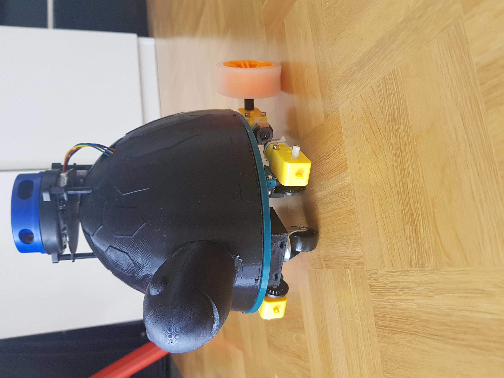
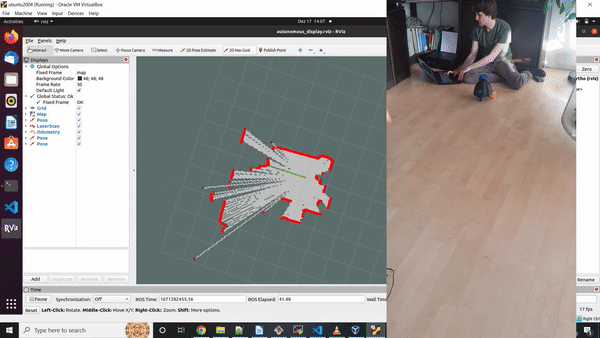

### all_seeing_drone  
A project to introduce autonomous movement and face-following for a robolink CoDrone. I used the CoDrone API which lets you command roll, pitch, yaw, and throttle, but built a lot of functionality on top of that to do tracking, and in some cases rewrote bits of the CoDrone API to work with my needs. See the README [here](https://github.com/MZandtheRaspberryPi/all_seeing_drone).  

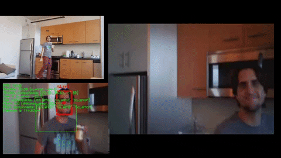  
Bottom left: processed drone video with debug information  
Top left: cell phone camera in corner of room, showing drone flying  
Right: raw drone input video  
Notice it tracking me!

Here's a youtube video showing off the project. There's a link in the description of this video to another video that is more technical and shows some of the project work.
[Making a PB&J with autonomous drone camera-person](https://www.youtube.com/watch?v=P_NQB7phWnQ&t)  

### great_ball_project
This project uses Asyncronous Real-Time Communication (via the python aiortc library) to send video from a server to a client. This video is of a green ball bouncing. The client then uses computer vision to find the center of the ball and send it back to the server which displays an error from the true value.    

Libraries used in include aiortc, numpy, opencv-python, and multiprocessing. In the below GIF, the window on the right has the raw frames from the server. The image on the left is overlaying a small blue dot on the calculated center, for display purposes. Unit tests, logging, config files, and more were added for code quality. Docker images and a deployment using Minikube were done as well.    
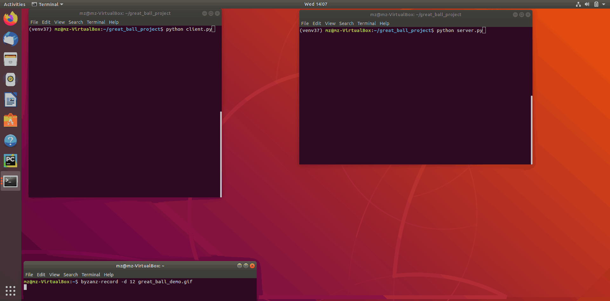  

### holiday_project_2023
I designed a custom circuit and printer circuit board using a 555 timer and a 4017 decade counter to be my christmas cards for 2023. You can find the files [here](https://github.com/MZandtheRaspberryPi/holiday_project_2023).  
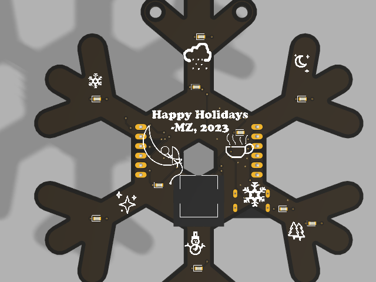  
  

### Spot Micro Robot
This was a fun project where I 3d printed the robot, planned the hardware, assembled, and used a fellow robot builder's ROS Repo to get it walking. I contributed a bit to the robot builder's ROS repo as well. It was mainly a hardware and electronics project for me. Check it out [here](https://github.com/MZandtheRaspberryPi/spot_micro_demo).   
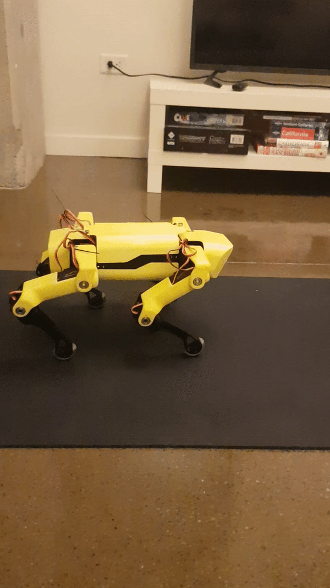   

### robo_arm
This is a robot arm project that I built from the ground up, including the software. It has two capabilities. The first is an arduino based arm that can be controlled via onboard joysticks and displays output to an OLED screen as it moves in x, y, z space with an inverse kinematic model. The second is a ROS Powered version that uses rosserial to communicate with the master node, and allows publishing of messages on a topic to command the arm in x, y, z coordinates. You can get to the repo [here](https://github.com/MZandtheRaspberryPi/robo_arm).  
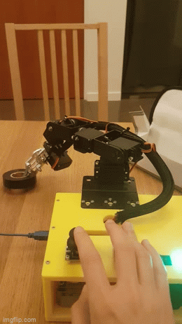  

[Here](https://www.youtube.com/watch?v=9vvvBXWQKJA) is a demo of the arduino based version of the arm, and [here](https://www.youtube.com/watch?v=Fptv3H4Jj54) is a demo of the ros based version of the arm.  

### prod_disaster_counter 
This was a fun project to make a little device that can count things for people, like days in a row they've meditated, practiced a musical instrument, or gone for a walk. I made two versions of this. The first was hastily done on a prototyping board, the second was designed and manufactured to be prettier and more functional. You can find the documentation including cad, ecad, and code [here](https://github.com/MZandtheRaspberryPi/prod_disaster_counter).  

You can see a video demo [here](https://www.youtube.com/watch?v=l-LTvP333-I).  
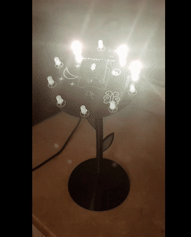  

### Ultrasonic Bat
This was a project I organized and led with a group of friends. It is a small bat to hang on a christmas tree or put on a desk, that has ultrasonic sensors, RGB lights in the wings, and an OLED screen for a face. It can react when it sees things in front of it! I did all the 3d design and printing, as well as some of the software work relating to the oled and facial animations. I also coordinated with the hardware group, the software group, and the design group to make sure all the intermediate pieces worked together in the end product. You can find more info [here](https://github.com/MZandtheRaspberryPi/holiday_project_2022/).  
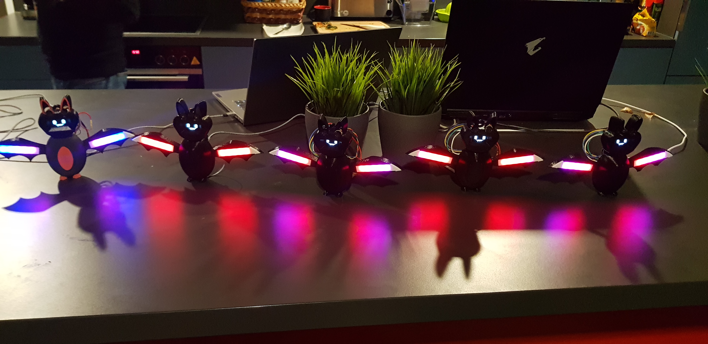  

### magic_box
This was a magical light box I built for a friend getting married. It has animations, looks pretty, and lets the user set the color for some of the animaetions. You can get to the repo with more details [here](https://github.com/MZandtheRaspberryPi/magic_box).  
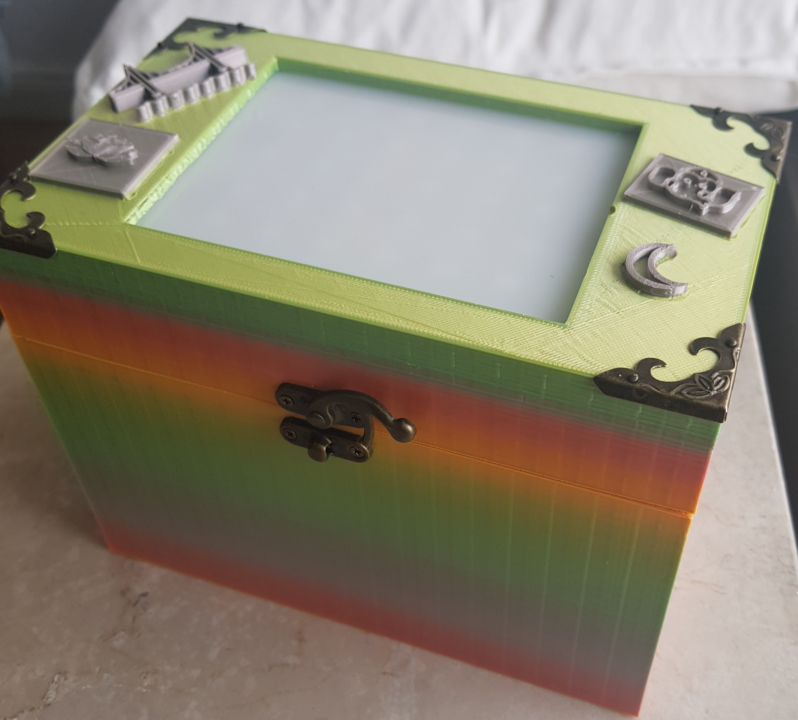  
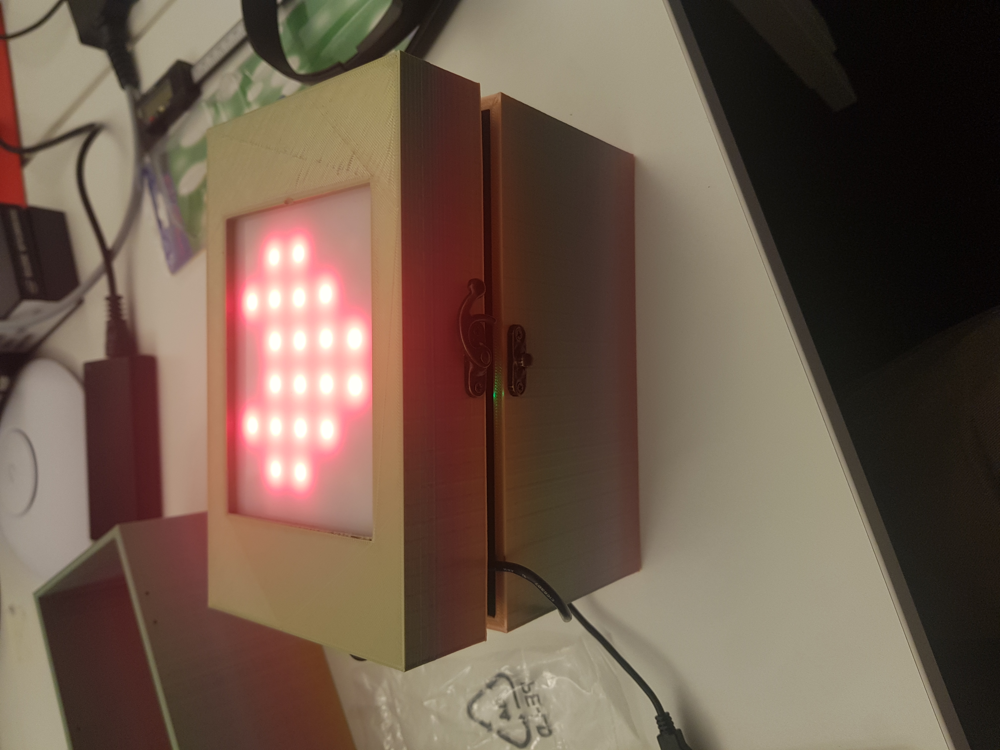  

### Buddy Robot Dance with ROS
This was a fun project to get a robot to dance using ROS. I used a robot from Slant Concepts and re-coded it to work with ROS, via rosserial and a bluetooth connection. Check it out [here](https://github.com/MZandtheRaspberryPi/ros_buddy).    
    

### Pi Watch    
This was a project to make a raspberry pi watch that can check buses near my apartment, show the weather, and turn off with button presses. Check out the repo [here](https://github.com/MZandtheRaspberryPi/pi_watch) and a video showing off the project [here](https://www.youtube.com/watch?v=JhEXCvS3W6M).    
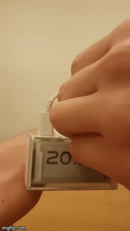   

### Tableau Wine Night
This was a fun project to create a dataset from a winetasting I did among friends. From there I analyzed the data, created metrics, and presented an interactive visualization on it via Tableau Public. Find it [here](https://public.tableau.com/app/profile/michael.ziegltrum/viz/WineNight/TheStoryofWineNight).  
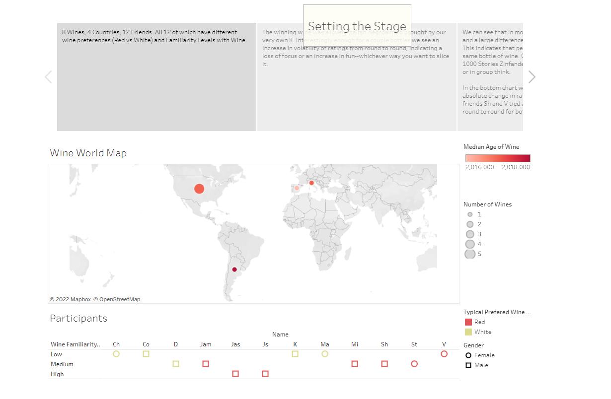  

## Smaller Projects

### headless_pi_setup
A guide on how to setup a Raspberry Pi with an emphasis on security, without a keyboard or display for the Pi. See the guide [here](https://github.com/MZandtheRaspberryPi/pi_headless_setup)!   
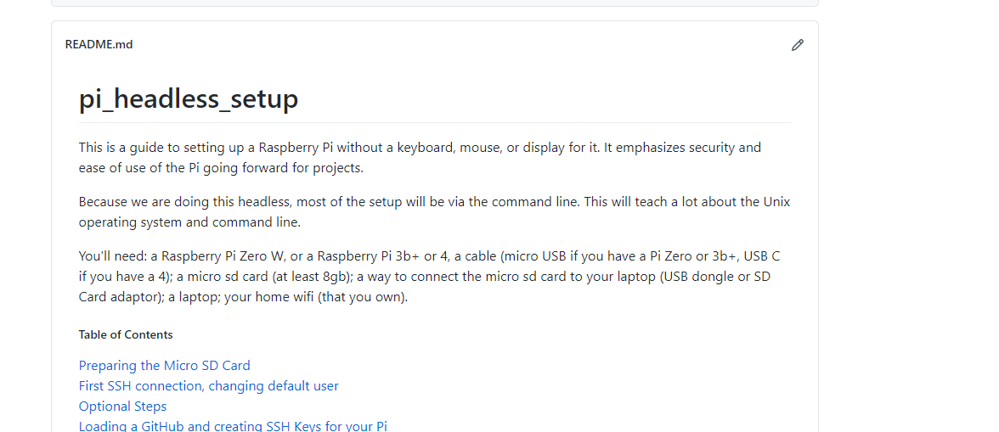    

### Alexa and Raspberry Pi Lamp
A demo on how to control a Raspberry Pi Lamp using an Echo Dot. See the repo with links to guides [here](https://github.com/MZandtheRaspberryPi/alexa_lamp).    

### Mood Lamp Guide
Here's a guide that is more a collection of tutorials to help you get your raspberry pi mood lamp kit from pimoroni up and running. Check it out [here](https://github.com/MZandtheRaspberryPi/mood_lamp_guide/blob/main/README.md).    

### Minecraft Server on your Pi
This has some links to guides to setup a minecraft server on your pi, as well as some tips on running the server and extra commands! Check it out [here](https://github.com/MZandtheRaspberryPi/pi_minecraft/blob/main/README.md).     
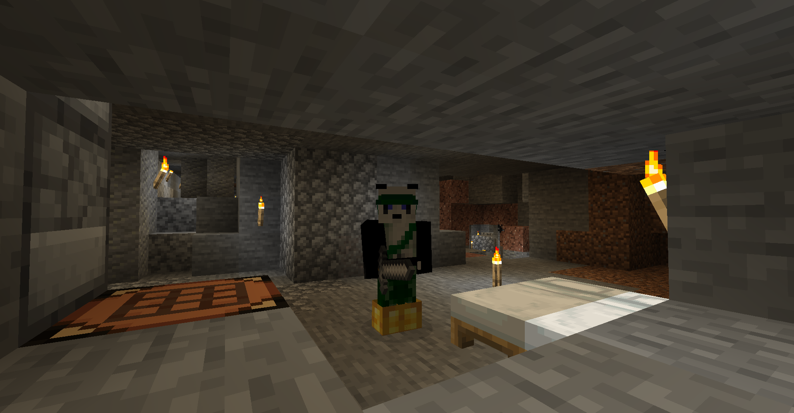

### R2D2 Sculpture with Amazon Echo Inside
This was a fun project to slice and print out some models I found and assemble them. Check it out [here](https://github.com/MZandtheRaspberryPi/r2d2_echo_stand/blob/main/README.md).     
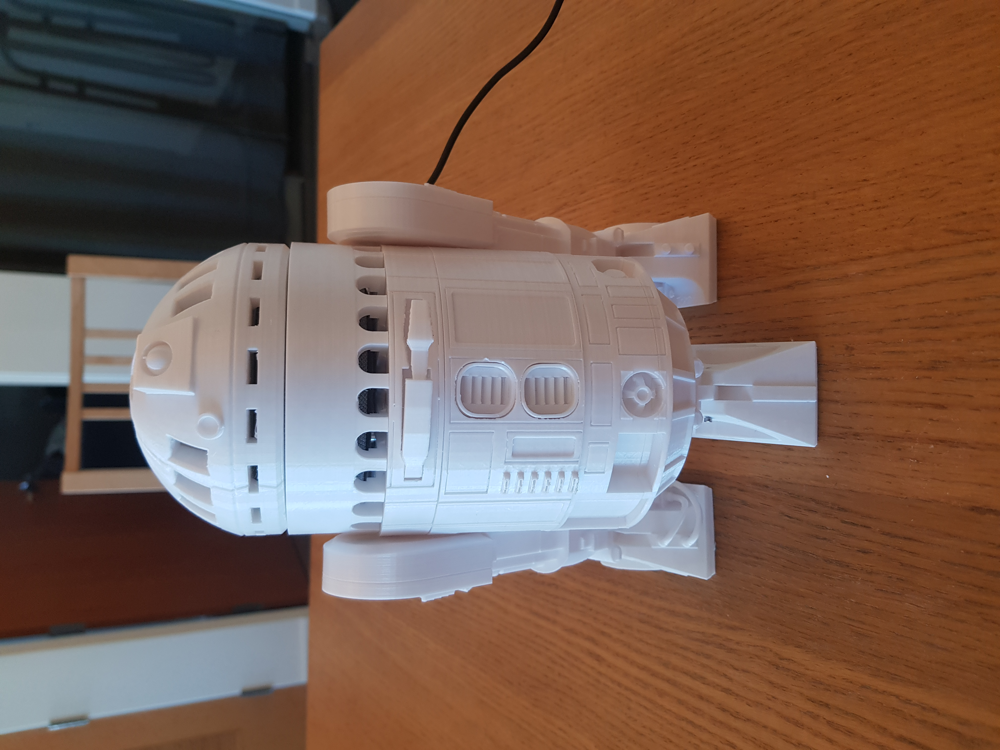  
